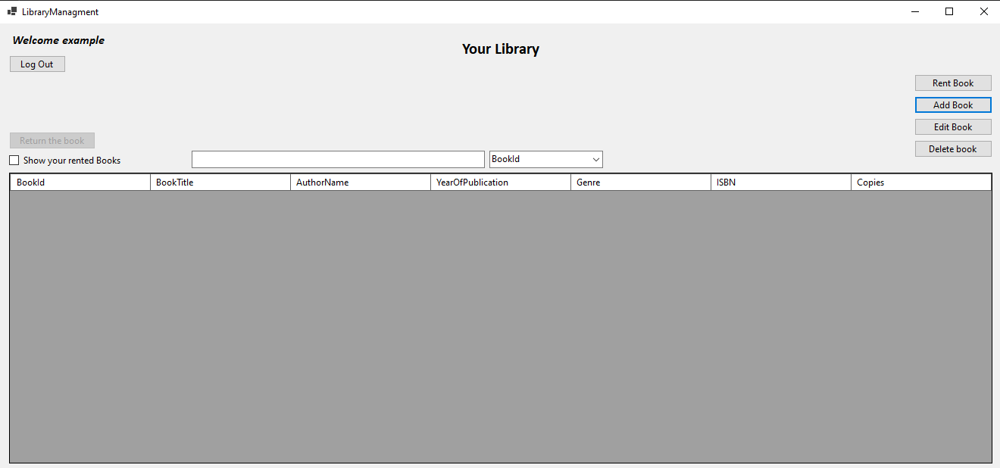

# Library managment App

It's Library managment desktop app written in WinForms .NET 8.0. 
It allows you to create your account, log in and manage your library.

### Technologies:
- C#
- WinForms
- .Net 8.0
- MSSQL (database)

## Screenshots

### Login Page
You can login if you have account. If you don't - you can easly registry

### Register Page
There you can register. Also there is implemented hasing passwords, so your data is safe :)

### Main Library Page
There you have a lot of options. Your can add books, edit existing books, deleting books and searching data depending on which column you want to search. Your data is displaying on a table.

### Adding a new book into library
There you can add book with amount of copies you want to have in your library.

### Created a Book
How you can see, there is created book which we created

### Renting a Book
By clicking "rent book" user can rent book and decide when he wants to return it. It also allows you to rent more than one copy but not more than is on the stock !

### Rented books
This is how it looks like, when we rent a books. You can return it anytime you want. To see library books, you have to only uncheck checkbox with a sign "Hide your rented books"

